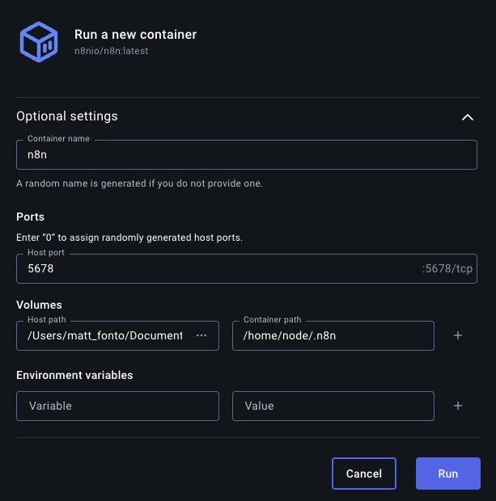
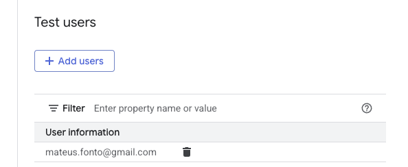
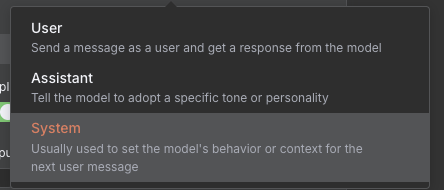
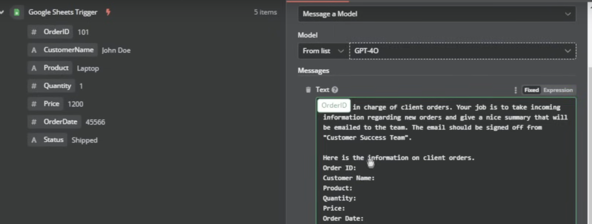

# n8n

- low-code automation tool
- allow workflow build
- benefits of automating workflows
  - increased efficiency
  - time & cost savings
  - scalability
  - improved data handling
  - enhanced customer experience

## n8n workflow ideas

- Automated lead enrichment + CRM sync
- Newsletter curation assistant
- Job monitoring & alert system
- Custom social media automation
- Client onboarding

## n8n interface

- Workflow: the recipe
- Nodes: Each step, each ingredient
- Execution: when an order comes in

## Part 1: Core concepts

### types of nodes

- triggers
  - what they do: tell n8n when/how to start the workflow
  - types: manual, scheduled, on chat, on event, called by another workflow
- action
  - what they do: the "doers", they perform specific tasks
  - types: send email, create record, make api request, get text messages, set calendar event, etc
- data transformation
  - what they do: change or process the data flowing through
  - types:
    - set: add fields, change values, reduce data
    - aggregate: combines data into a single output
    - merge: combining data from two sources
- logic
  - what they do: conditional decision makers
  - types:
    - if
    - switch
    - wait
- first workflow

## setup docker mac n8n



<!-- to continue: 23:20 -->

https://www.youtube.com/watch?v=ZHH3sr234zY&list=PLFbXZOeg7GKZdj0IvSrln2WbrJh54ci25&index=16

## google oauth

- setup the connection by:

1. add the oauth redirect url to google cloud
2. app will initially be on testing, you should add yourself as test users

- go to audience/test users/add your email

 3. add secret and client id to the integration

## setting up AI

- Create a node: chat with model
- Setup the credentials
- Add a message -- you can add multiple. This is like the prompt.

  - Here you can tell the message how to behave. There are 3 options:
  - User: similar to the experience of the chat
  - Assistant: shapes the style (tone/personality) of the AI
  - System: shapes the behavior of the AI. Also used to specify output

  

- Then, drag and drop the fields into the prompt to make them variables



- Once the execution is fine, click in activating it

## Part 2: RAG and Vector Databases

### RAG - Retrieval-Augmented Generation

- RAG: Retrieval-Augmented Generation
  - RAG is awesome for up-to-date and customized generation
- Helps AI models provide more accurate and relevant answers
  - Retrieval: Retrives relevant information from external sources
  - Generation: AI uses this information to generate an answer

### Vector Databases

- RAG needs a way to store and retrieve data efficiently
- Vectors:
  - Data stored in "vectors"
  - Numerical database that represents the meaning of words, text, etc
  - Relevant information quickly

### Embed Data to Vector Database

- Data loading:
  - Handles the data coming in to pass it off to a text splitter
- Text splitting:
  - "Chunks" up the text for more efficient retrieval
    - Character, recursive character, token

#### Supabase

- Select supabase vector store

  - Add document to vector store
  - add the service_role key and the url
    - settings/configuration/data API
    - quick start for vector db: https://supabase.com/docs/guides/ai/langchain?database-method=sql

- Initializing vector sql

```sql

-- Enable the pgvector extension to work with embedding vectors
create extension vector;

-- Create a table to store your documents
create table documents (
  id bigserial primary key,
  content text, -- corresponds to Document.pageContent
  metadata jsonb, -- corresponds to Document.metadata
  embedding vector(1536) -- 1536 works for OpenAI embeddings, change if needed
);

-- Create a function to search for documents
create function match_documents (
  query_embedding vector(1536),
  match_count int default null,
  filter jsonb DEFAULT '{}'
) returns table (
  id bigint,
  content text,
  metadata jsonb,
  similarity float
)
language plpgsql
as $$
#variable_conflict use_column
begin
  return query
  select
    id,
    content,
    metadata,
    1 - (documents.embedding <=> query_embedding) as similarity
  from documents
  where metadata @> filter
  order by documents.embedding <=> query_embedding
  limit match_count;
end;
$$;
```
